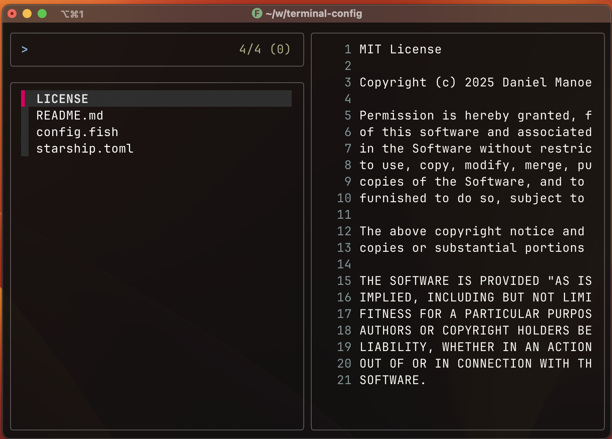
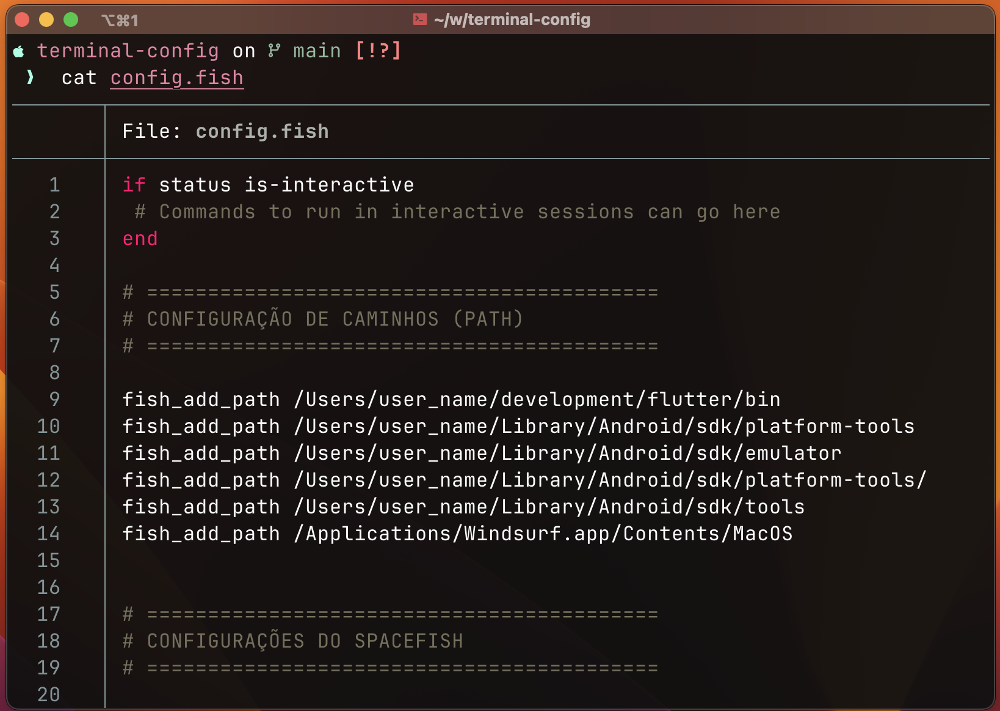

# Configuração do Terminal macOS

Este repositório contém a configuração completa do meu terminal no macOS usando **iTerm2**, incluindo Fish shell, Starship prompt e diversas ferramentas de produtividade.

## 📸 Screenshots

### Terminal Principal

*Terminal com Starship prompt mostrando informações do Git e linguagens*

### Comandos em Ação

*Demonstração dos aliases `ls`, `lt` (tree) e `cat` com syntax highlighting*

### FZF em Funcionamento

*Fuzzy finder com preview de arquivos usando Bat*

### Bat em Funcionamento

* Preview de arquivos utilizando somente Bat*

## Índice

- [Pré-requisitos](#pré-requisitos)
- [Instalação](#instalação)
- [Ferramentas Incluídas](#ferramentas-incluídas)
- [Configuração](#configuração)
- [Aliases Disponíveis](#aliases-disponíveis)
- [Personalização](#personalização)

## Pré-requisitos

### Terminal
- **iTerm2** - Terminal avançado para macOS (recomendado)
```bash
brew install --cask iterm2
```

### Homebrew
Gerenciador de pacotes para macOS:
```bash
/bin/bash -c "$(curl -fsSL https://raw.githubusercontent.com/Homebrew/install/HEAD/install.sh)"
```

## Instalação

### 1. Instalar as ferramentas necessárias

```bash
# Fish Shell - Shell moderno e user-friendly
brew install fish

# Starship - Prompt customizável e rápido
brew install starship

# Eza - Substituto moderno do ls com cores e ícones
brew install eza

# Bat - Substituto do cat com syntax highlighting
brew install bat

# Zoxide - Navegação inteligente de diretórios
brew install zoxide

# FZF - Fuzzy finder para busca interativa
brew install fzf

# Nerd Fonts - Para ícones no terminal
brew tap homebrew/cask-fonts
brew install --cask font-fira-code-nerd-font
```

### 2. Configurar Fish como shell padrão

```bash
# Adicionar Fish à lista de shells válidos
echo /opt/homebrew/bin/fish | sudo tee -a /etc/shells

# Definir Fish como shell padrão
chsh -s /opt/homebrew/bin/fish
```

### 3. Aplicar as configurações

```bash
# Criar diretórios de configuração
mkdir -p ~/.config/fish
mkdir -p ~/.config

# Copiar configurações
cp config.fish ~/.config/fish/
cp starship.toml ~/.config/
```

## Ferramentas Incluídas

### **iTerm2**
- Terminal avançado com suporte a abas e painéis
- Melhor renderização de cores e fontes
- Integração nativa com Nerd Fonts

### **Fish Shell**
- Shell moderno com autocompletar inteligente
- Syntax highlighting em tempo real
- Configuração amigável sem necessidade de plugins

### **Starship**
- Prompt rápido e customizável
- Detecção automática de linguagens e ferramentas
- Informações contextuais do Git
- Ícones para diferentes tecnologias

### **Eza**
- Substituto moderno do comando `ls`
- Suporte a ícones coloridos
- Integração com Git para mostrar status dos arquivos
- Visualização em árvore

### **Bat**
- Substituto do `cat` com syntax highlighting
- Tema automático baseado no sistema (claro/escuro)
- Numeração de linhas e integração com Git

### **Zoxide**
- Navegação inteligente de diretórios
- Aprende e lembra dos caminhos mais utilizados
- Substituto inteligente do comando `cd`

### **FZF**
- Fuzzy finder para busca interativa
- Preview de arquivos integrado com Bat
- Busca no histórico de comandos
- Integração com Fish shell

## Configuração

Os arquivos de configuração incluem:

- **`config.fish`** - Configuração principal do Fish shell com aliases, caminhos e inicializações
- **`starship.toml`** - Personalização do prompt com ícones e cores para diferentes linguagens

### Caminhos Configurados (Pessoal)
Esses caminhos dependem muito das tecnologias que você utiliza.
Exemplo:

- Flutter SDK para desenvolvimento mobile:
fish_add_path /Users/user_name/development/flutter/bin


### Inicializações Automáticas
- Starship prompt
- Zoxide para navegação
- FZF com preview
- Remoção da mensagem de boas-vindas

## Aliases Disponíveis

| Comando | Função |
|---------|--------|
| `ls` | Lista arquivos com ícones, cores e informações do Git |
| `l` | Lista detalhada incluindo arquivos ocultos |
| `la` | Lista com ícones agrupando diretórios primeiro |
| `lt` | Visualização em árvore dos diretórios |
| `cd` | Navegação inteligente com Zoxide |
| `cat` | Visualização com syntax highlighting automático |
| `codew` | Abre Windsurf no diretório atual |

## Personalização

### Configurar Fonte no iTerm2
1. Abra iTerm2 → Preferences → Profiles → Text
2. Selecione **FiraCode Nerd Font** como fonte
3. Ative "Use ligatures" para símbolos especiais

### Temas do Starship
Experimente diferentes temas pré-definidos:
```bash
starship preset nerd-font-symbols -o ~/.config/starship.toml
```

### Personalizar Aliases
Edite `~/.config/fish/config.fish` para adicionar seus próprios aliases.

## 🔄 Atualização

```bash
# Atualizar todas as ferramentas
brew update && brew upgrade

# Atualizar configurações do repositório
git pull
cp config.fish ~/.config/fish/
cp starship.toml ~/.config/
```

## Solução de Problemas

### Ícones não aparecem
- Instale uma Nerd Font
- Configure iTerm2 para usar a fonte
- Reinicie o terminal

### Fish não carrega
- Verifique se está na lista de shells: `cat /etc/shells`
- Confirme a instalação: `which fish`

---

## 📄 Licença

Este projeto está licenciado sob a Licença MIT - veja o arquivo [LICENSE](LICENSE) para detalhes.

**Terminal:** iTerm2  
**By:** Daniel Manoel
